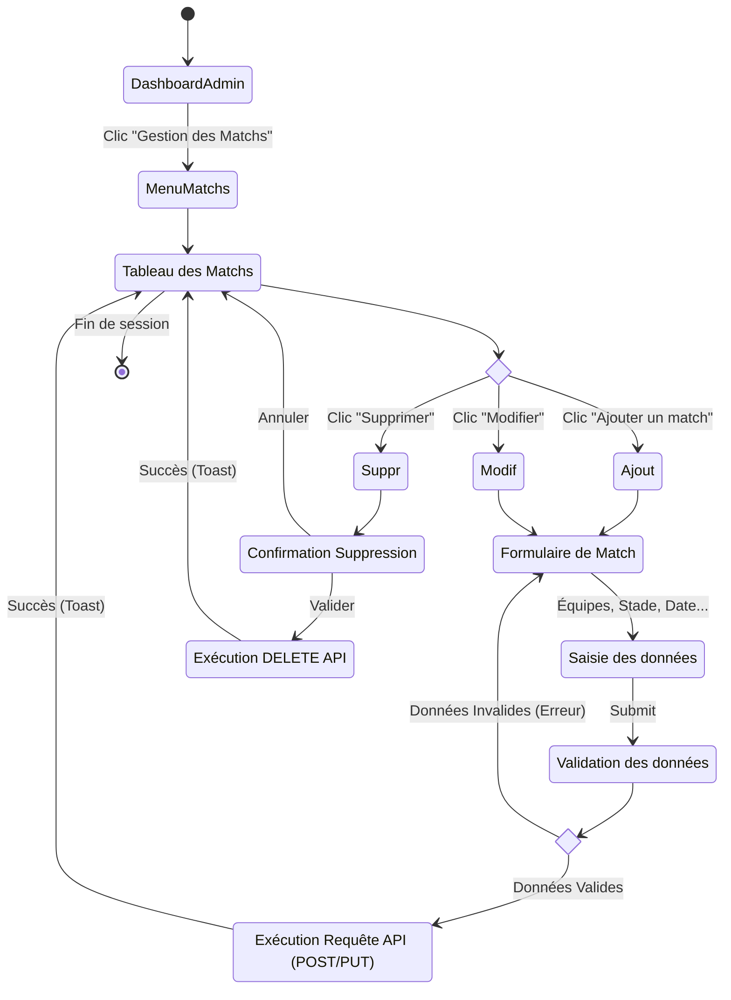

# Diagramme d'Activité : Gestion de Match (Administration)

Ce diagramme d'activité décrit les actions de l'administrateur lors de l'ajout ou la modification d'un match de Botola.

```mermaid
stateDiagram-v2
    [*] --> DashboardAdmin
    
    DashboardAdmin --> MenuMatchs: Clic "Gestion des Matchs"
    
    state "Tableau des Matchs" as TableMatchs
    MenuMatchs --> TableMatchs
    
    state action <<choice>>
    TableMatchs --> action
    
    action --> Ajout: Clic "Ajouter un match"
    action --> Modif: Clic "Modifier"
    action --> Suppr: Clic "Supprimer"
    
    state "Formulaire de Match" as FormMatch
    Ajout --> FormMatch
    Modif --> FormMatch
    
    state "Saisie des données" as Saisie
    FormMatch --> Saisie: Équipes, Stade, Date...
    
    state "Validation des données" as Validation
    Saisie --> Validation: Submit
    
    state check <<choice>>
    Validation --> check
    
    check --> FormMatch: Données Invalides (Erreur)
    check --> TraitementServeur: Données Valides
    
    state "Exécution Requête API (POST/PUT)" as TraitementServeur
    TraitementServeur --> TableMatchs: Succès (Toast)
    
    state "Confirmation Suppression" as ConfirmSuppr
    Suppr --> ConfirmSuppr
    ConfirmSuppr --> TableMatchs: Annuler
    
    state "Exécution DELETE API" as ExecSuppr
    ConfirmSuppr --> ExecSuppr: Valider
    ExecSuppr --> TableMatchs: Succès (Toast)
    
    TableMatchs --> [*]: Fin de session
```
