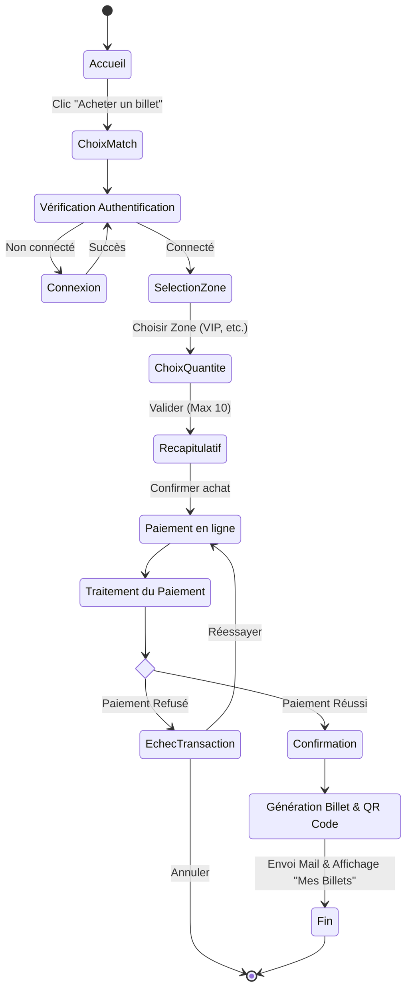

# Diagramme d'Activité : Réservation de Billet

Ce diagramme d'activité illustre le flux détaillé d'actions lors du processus d'achat de billet.

```mermaid
stateDiagram-v2
    [*] --> Accueil
    Accueil --> ChoixMatch: Clic "Acheter un billet"
    
    state "Vérification Authentification" as CheckAuth
    ChoixMatch --> CheckAuth
    
    CheckAuth --> Connexion: Non connecté
    Connexion --> CheckAuth: Succès
    
    CheckAuth --> SelectionZone: Connecté
    
    SelectionZone --> ChoixQuantite: Choisir Zone (VIP, etc.)
    ChoixQuantite --> Recapitulatif: Valider (Max 10)
    
    state "Paiement en ligne" as Paiement
    Recapitulatif --> Paiement: Confirmer achat
    
    state "Traitement du Paiement" as TraitementPaiement
    Paiement --> TraitementPaiement
    
    state condition <<choice>>
    TraitementPaiement --> condition
    
    condition --> Confirmation: Paiement Réussi
    condition --> EchecTransaction: Paiement Refusé
    
    EchecTransaction --> Paiement: Réessayer
    EchecTransaction --> [*]: Annuler
    
    state "Génération Billet & QR Code" as GenBillet
    Confirmation --> GenBillet
    
    GenBillet --> Fin: Envoi Mail & Affichage "Mes Billets"
    Fin --> [*]
```
