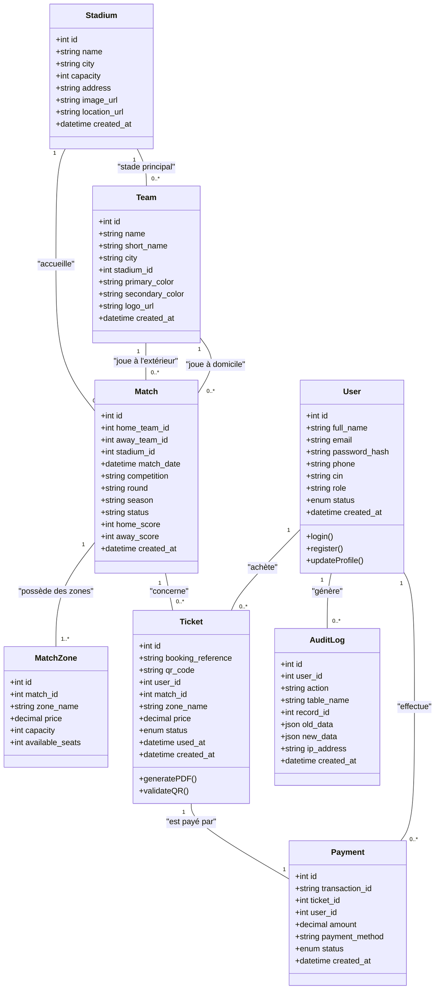

# Diagramme de Classes

Ce diagramme représente la structure des données et les relations entre les entités métier du système de billetterie Botola Pro Inwi (MCD/MLD orienté objet).

```mermaid
classDiagram
    class User {
        +int id
        +string full_name
        +string email
        +string password_hash
        +string phone
        +string cin
        +string role
        +enum status
        +datetime created_at
        +login()
        +register()
        +updateProfile()
    }

    class Team {
        +int id
        +string name
        +string short_name
        +string city
        +int stadium_id
        +string primary_color
        +string secondary_color
        +string logo_url
        +datetime created_at
    }

    class Stadium {
        +int id
        +string name
        +string city
        +int capacity
        +string address
        +string image_url
        +string location_url
        +datetime created_at
    }

    class Match {
        +int id
        +int home_team_id
        +int away_team_id
        +int stadium_id
        +datetime match_date
        +string competition
        +string round
        +string season
        +string status
        +int home_score
        +int away_score
        +datetime created_at
    }

    class MatchZone {
        +int id
        +int match_id
        +string zone_name
        +decimal price
        +int capacity
        +int available_seats
    }

    class Ticket {
        +int id
        +string booking_reference
        +string qr_code
        +int user_id
        +int match_id
        +string zone_name
        +decimal price
        +enum status
        +datetime used_at
        +datetime created_at
        +generatePDF()
        +validateQR()
    }

    class Payment {
        +int id
        +string transaction_id
        +int ticket_id
        +int user_id
        +decimal amount
        +string payment_method
        +enum status
        +datetime created_at
    }

    class AuditLog {
        +int id
        +int user_id
        +string action
        +string table_name
        +int record_id
        +json old_data
        +json new_data
        +string ip_address
        +datetime created_at
    }

    User "1" -- "0..*" Ticket : "achète"
    User "1" -- "0..*" Payment : "effectue"
    Ticket "1" -- "1" Payment : "est payé par"
    
    Match "1" -- "0..*" Ticket : "concerne"
    Match "1" -- "1..*" MatchZone : "possède des zones"
    
    Team "1" -- "0..*" Match : "joue à domicile"
    Team "1" -- "0..*" Match : "joue à l'extérieur"
    
    Stadium "1" -- "0..*" Match : "accueille"
    Stadium "1" -- "0..*" Team : "stade principal"
    
    User "1" -- "0..*" AuditLog : "génère"
```
