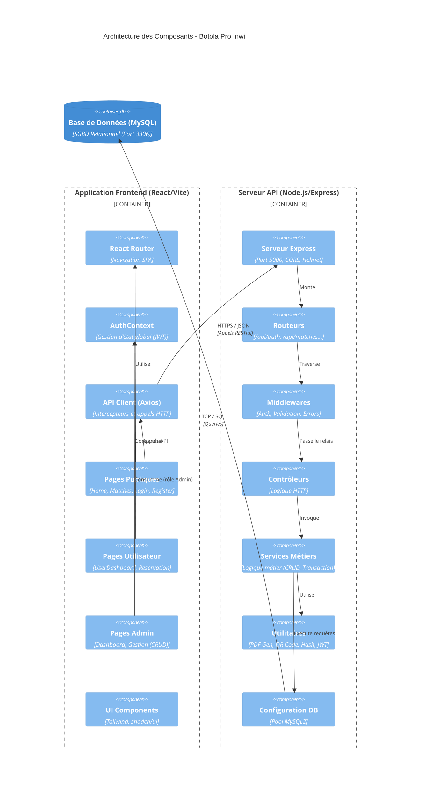

# Diagramme de Composants

Ce diagramme présente l'architecture matérielle et logicielle du système, montrant comment les différents composants de l'application Botola Pro interagissent.

```mermaid
C4Component
    title Architecture des Composants - Botola Pro Inwi

    Container_Boundary(frontend, "Application Frontend (React/Vite)") {
        Component(router, "React Router", "Navigation SPA")
        Component(auth_ctx, "AuthContext", "Gestion d'état global (JWT)")
        Component(api_client, "API Client (Axios)", "Intercepteurs et appels HTTP")
        Component(pages_public, "Pages Publiques", "Home, Matches, Login, Register")
        Component(pages_user, "Pages Utilisateur", "UserDashboard, Reservation")
        Component(pages_admin, "Pages Admin", "Dashboard, Gestion (CRUD)")
        Component(ui_components, "UI Components", "Tailwind, shadcn/ui")
        
        Rel(pages_public, router, "Utilise")
        Rel(pages_user, auth_ctx, "Consomme")
        Rel(pages_admin, auth_ctx, "Consomme (rôle Admin)")
        Rel(pages_public, api_client, "Appels API")
    }

    Container_Boundary(backend, "Serveur API (Node.js/Express)") {
        Component(server, "Serveur Express", "Port 5000, CORS, Helmet")
        Component(routes, "Routeurs", "/api/auth, /api/matches...")
        Component(middlewares, "Middlewares", "Auth, Validation, Errors")
        Component(controllers, "Contrôleurs", "Logique HTTP")
        Component(services, "Services Métiers", "Logique métier (CRUD, Transaction)")
        Component(utils, "Utilitaires", "PDF Gen, QR Code, Hash, JWT")
        Component(db_config, "Configuration DB", "Pool MySQL2")
        
        Rel(server, routes, "Monte")
        Rel(routes, middlewares, "Traverse")
        Rel(middlewares, controllers, "Passe le relais")
        Rel(controllers, services, "Invoque")
        Rel(services, utils, "Utilise")
        Rel(services, db_config, "Exécute requêtes")
    }

    ContainerDb(database, "Base de Données (MySQL)", "SGBD Relationnel (Port 3306)")

    Rel(api_client, server, "HTTPS / JSON", "Appels RESTful")
    Rel(db_config, database, "TCP / SQL", "Queries")
```
