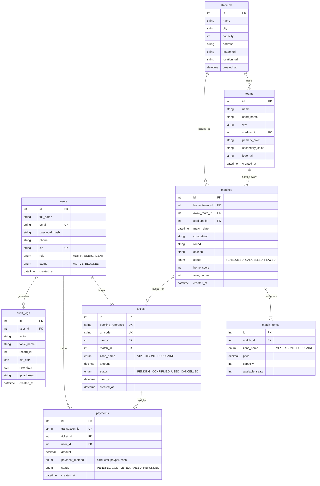

# Diagramme ERD (Entity Relationship Diagram)

Ce diagramme représente la structure relationnelle de la base de données MySQL utilisée pour le backend de Botola Pro Inwi.

```mermaid
erDiagram
    users ||--o{ tickets : "books"
    users ||--o{ payments : "makes"
    users ||--o{ audit_logs : "generates"
    
    users {
        int id PK
        string full_name
        string email UK
        string password_hash
        string phone
        string cin UK
        enum role "ADMIN, USER, AGENT"
        enum status "ACTIVE, BLOCKED"
        datetime created_at
    }

    teams ||--o{ matches : "home / away"
    stadiums ||--o{ teams : "hosts"
    stadiums ||--o{ matches : "located_at"

    teams {
        int id PK
        string name
        string short_name
        string city
        int stadium_id FK
        string primary_color
        string secondary_color
        string logo_url
        datetime created_at
    }

    stadiums {
        int id PK
        string name
        string city
        int capacity
        string address
        string image_url
        string location_url
        datetime created_at
    }

    matches ||--|{ match_zones : "configures"
    matches ||--o{ tickets : "issued_for"

    matches {
        int id PK
        int home_team_id FK
        int away_team_id FK
        int stadium_id FK
        datetime match_date
        string competition
        string round
        string season
        enum status "SCHEDULED, CANCELLED, PLAYED"
        int home_score
        int away_score
        datetime created_at
    }

    match_zones {
        int id PK
        int match_id FK
        enum zone_name "VIP, TRIBUNE, POPULAIRE"
        decimal price
        int capacity
        int available_seats
    }

    tickets ||--o| payments : "paid_by"

    tickets {
        int id PK
        string booking_reference UK
        string qr_code UK
        int user_id FK
        int match_id FK
        enum zone_name "VIP, TRIBUNE, POPULAIRE"
        decimal amount
        enum status "PENDING, CONFIRMED, USED, CANCELLED"
        datetime used_at
        datetime created_at
    }

    payments {
        int id PK
        string transaction_id UK
        int ticket_id FK
        int user_id FK
        decimal amount
        enum payment_method "card, cmi, paypal, cash"
        enum status "PENDING, COMPLETED, FAILED, REFUNDED"
        datetime created_at
    }

    audit_logs {
        int id PK
        int user_id FK
        string action
        string table_name
        int record_id
        json old_data
        json new_data
        string ip_address
        datetime created_at
    }
```
