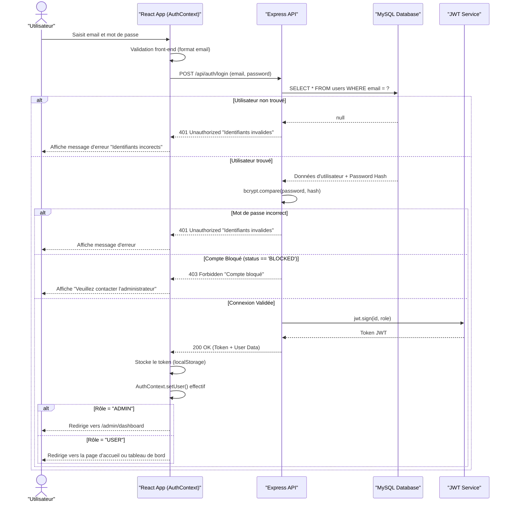

# Diagramme de Séquence : Connexion (Login)

Ce diagramme explique le flux d'authentification d'un utilisateur sur l'application Botola Pro Inwi, y compris la génération et vérification du token JWT.

