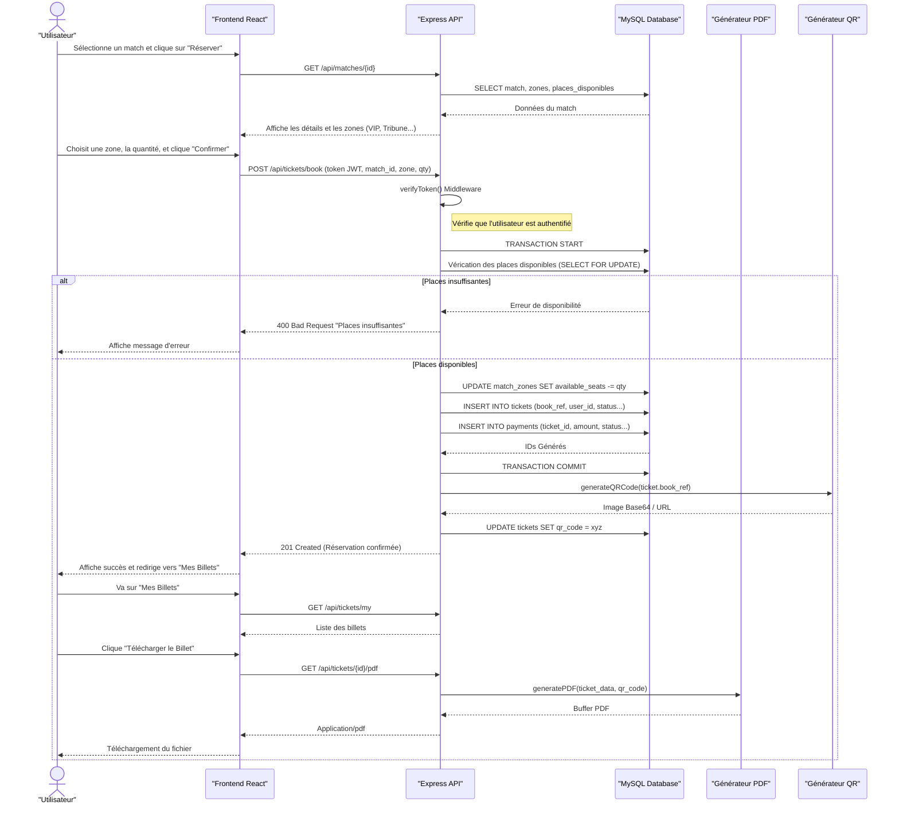

# Diagramme de Séquence : Réservation de Billet

Ce diagramme détaille le processus de réservation d'un billet par un fan pour un match de la Botola Pro sur la plateforme.

```mermaid
sequenceDiagram
    actor Fan as "Utilisateur"
    participant UI as "Frontend React"
    participant API as "Express API"
    participant DB as "MySQL Database"
    participant PDF as "Générateur PDF"
    participant QR as "Générateur QR"

    Fan->>UI: Sélectionne un match et clique sur "Réserver"
    UI->>API: GET /api/matches/{id}
    API->>DB: SELECT match, zones, places_disponibles
    DB-->>API: Données du match
    API-->>UI: Affiche les détails et les zones (VIP, Tribune...)
    
    Fan->>UI: Choisit une zone, la quantité, et clique "Confirmer"
    UI->>API: POST /api/tickets/book (token JWT, match_id, zone, qty)
    
    API->>API: verifyToken() Middleware
    Note right of API: Vérifie que l'utilisateur est authentifié
    
    API->>DB: TRANSACTION START
    API->>DB: Vérication des places disponibles (SELECT FOR UPDATE)
    
    alt Places insuffisantes
        DB-->>API: Erreur de disponibilité
        API-->>UI: 400 Bad Request "Places insuffisantes"
        UI-->>Fan: Affiche message d'erreur
    else Places disponibles
        API->>DB: UPDATE match_zones SET available_seats -= qty
        API->>DB: INSERT INTO tickets (book_ref, user_id, status...)
        API->>DB: INSERT INTO payments (ticket_id, amount, status...)
        DB-->>API: IDs Générés
        API->>DB: TRANSACTION COMMIT
        
        API->>QR: generateQRCode(ticket.book_ref)
        QR-->>API: Image Base64 / URL
        
        API->>DB: UPDATE tickets SET qr_code = xyz
        
        API-->>UI: 201 Created (Réservation confirmée)
        UI-->>Fan: Affiche succès et redirige vers "Mes Billets"
        
        Fan->>UI: Va sur "Mes Billets"
        UI->>API: GET /api/tickets/my
        API-->>UI: Liste des billets
        
        Fan->>UI: Clique "Télécharger le Billet"
        UI->>API: GET /api/tickets/{id}/pdf
        API->>PDF: generatePDF(ticket_data, qr_code)
        PDF-->>API: Buffer PDF
        API-->>UI: Application/pdf
        UI-->>Fan: Téléchargement du fichier
    end
```
