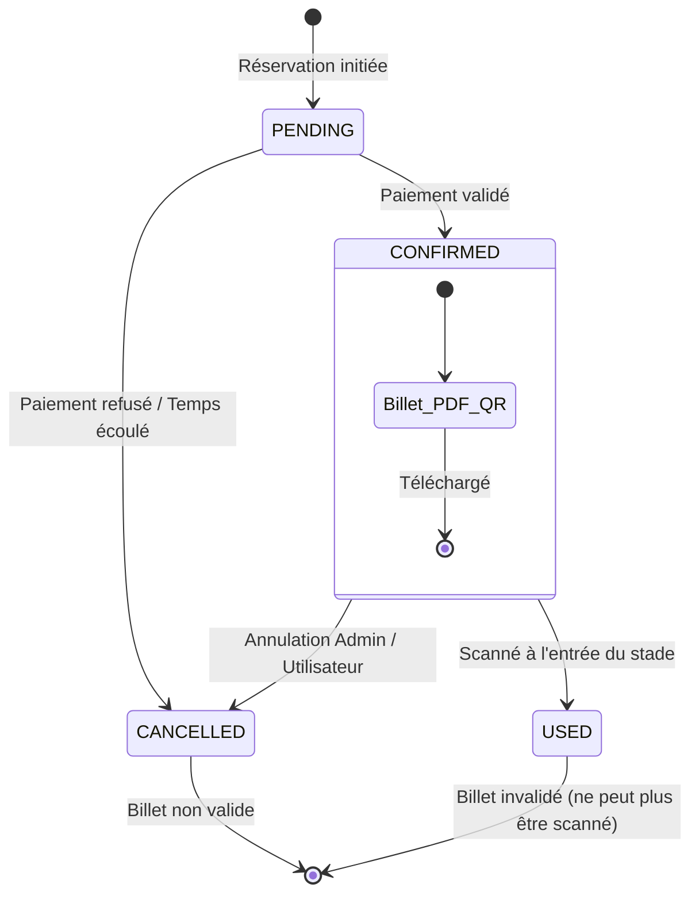

# Diagramme d'État : Cycle de Vie d'un Billet

Ce diagramme d'état illustre les différentes phases par lesquelles passe un billet de match Botola Pro Inwi, depuis sa réservation jusqu'à son utilisation ou annulation.

